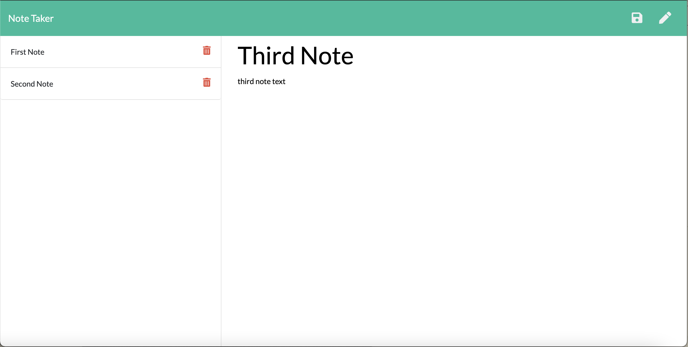
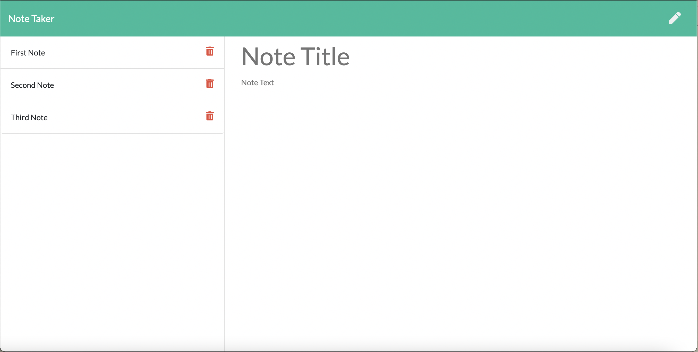

# Note-Taker

## Deployed Application 

https://serene-gorge-69684.herokuapp.com

## Description

This application uses an Express backend to save and retrieve note data from a JSON file. The user can write, edit, display and delete notes at the deployed website. The front end of this project was already created. 

## Installation 

This website is live on Heroku, but to run the application locally, clone this repository and run the following command in the terminal in order to install all dependencies: 

npm i

Run the following command to invoke the application. This will start the server:

node server.js 

Open a browser and go to the following address:

http://localhost:3000

## Images

## Technologies

Express.js
Node.js

## Questions

If you have any questions, please contact me at https://github.com/kilaweeks or kilaweeks@gmail.com. 
